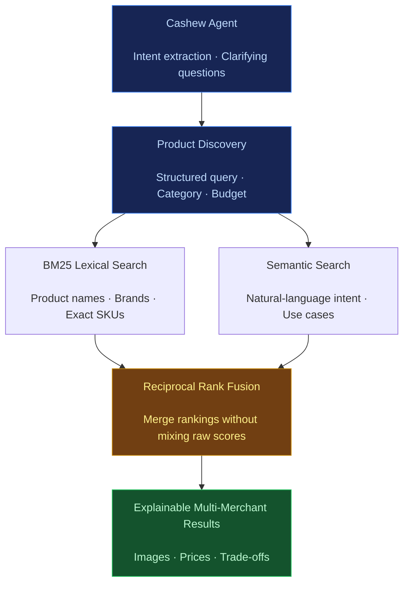
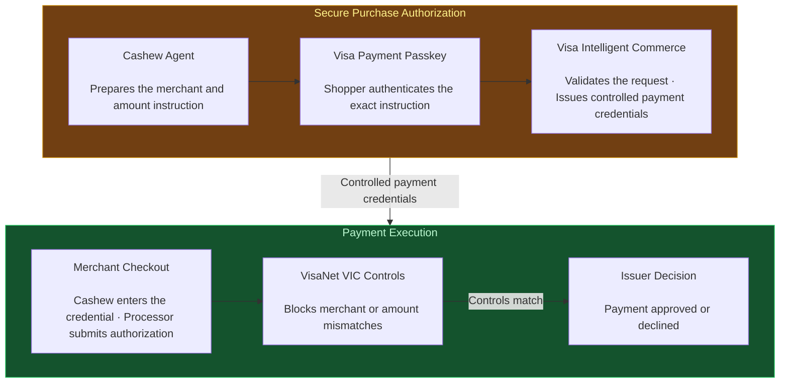

# Consumer Live Bot Architecture

## Product Discovery

```mermaid
flowchart TB
    A["Cashew Agent<br/><br/>Intent extraction · Clarifying questions"]
    A --> B["Product Discovery<br/><br/>Structured query · Category · Budget"]

    B --> C["BM25 Lexical Search<br/><br/>Product names · Brands · Exact SKUs"]
    B --> D["Semantic Search<br/><br/>Natural-language intent · Use cases"]

    C & D --> E["Reciprocal Rank Fusion<br/><br/>Merge rankings without mixing raw scores"]
    E --> F["Explainable Multi-Merchant Results<br/><br/>Images · Prices · Trade-offs"]

    style A fill:#172554,stroke:#3b82f6,color:#bfdbfe
    style B fill:#172554,stroke:#3b82f6,color:#bfdbfe
    style E fill:#713f12,stroke:#ca8a04,color:#fef08a
    style F fill:#14532d,stroke:#22c55e,color:#bbf7d0
```

## Secure Checkout

```mermaid
flowchart TB
    subgraph Authorization["Secure Purchase Authorization"]
        A["Cashew Agent<br/><br/>Prepares the merchant and amount instruction"]
        A --> B["Visa Payment Passkey<br/><br/>Shopper authenticates the exact instruction"]
        B --> C["Visa Intelligent Commerce<br/><br/>Validates the request · Issues controlled payment credentials"]
    end

    subgraph Execution["Payment Execution"]
        D["Merchant Checkout<br/><br/>Cashew enters the credential · Processor submits authorization"]
        D --> E["VisaNet VIC Controls<br/><br/>Blocks merchant or amount mismatches"]
        E -->|"Controls match"| F["Issuer Decision<br/><br/>Payment approved or declined"]
    end

    Authorization -->|"Controlled payment credentials"| Execution

    style Authorization fill:#713f12,stroke:#ca8a04,color:#fef08a
    style Execution fill:#14532d,stroke:#22c55e,color:#bbf7d0
```
